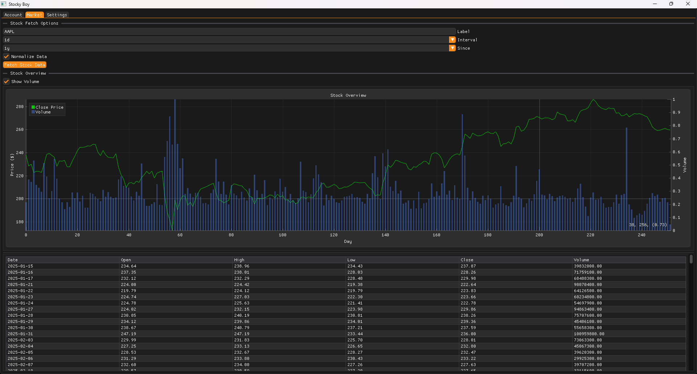

# StockyBoy

**StockyBoy** is a **C++ interface for Alpaca** that allows you to connect, monitor, and test stock trading strategies.  
Ideal for experimenting with automated trading bots and observing market data in real time.  

---

## Features

- **Alpaca Integration**: Fetch real-time stock prices, historical data, and account info.  
- **Bot Testing Platform**: Safely test trading algorithms in a controlled environment.  
- **Order Management**: Place, cancel, and track orders via Alpaca API.  
- **Lightweight Interface**: Minimal overhead for fast testing and development.  

---

## Usage

1. **Setup Alpaca API**  
   - Obtain API keys from your Alpaca account.  
   - Write keys in AccountName_CREDITENTIAL.txt in same folder as executable

2. **Connect to Market**  
   - Launch StockyBoy to establish a connection with Alpaca’s live or paper trading environment.  

3. **Test Bots**  
   - Run your trading algorithms.  
   - Monitor performance and debug strategies in real time.  

---

## Future Improvements

- **GUI Dashboard**: Visualize portfolios, trades, and live charts.  
- **Backtesting Module**: Simulate strategies on historical data.  

---

## Summary

StockyBoy provides a **robust, minimal interface** to interact with Alpaca, making it easy to test and develop stock trading bots safely and efficiently.
